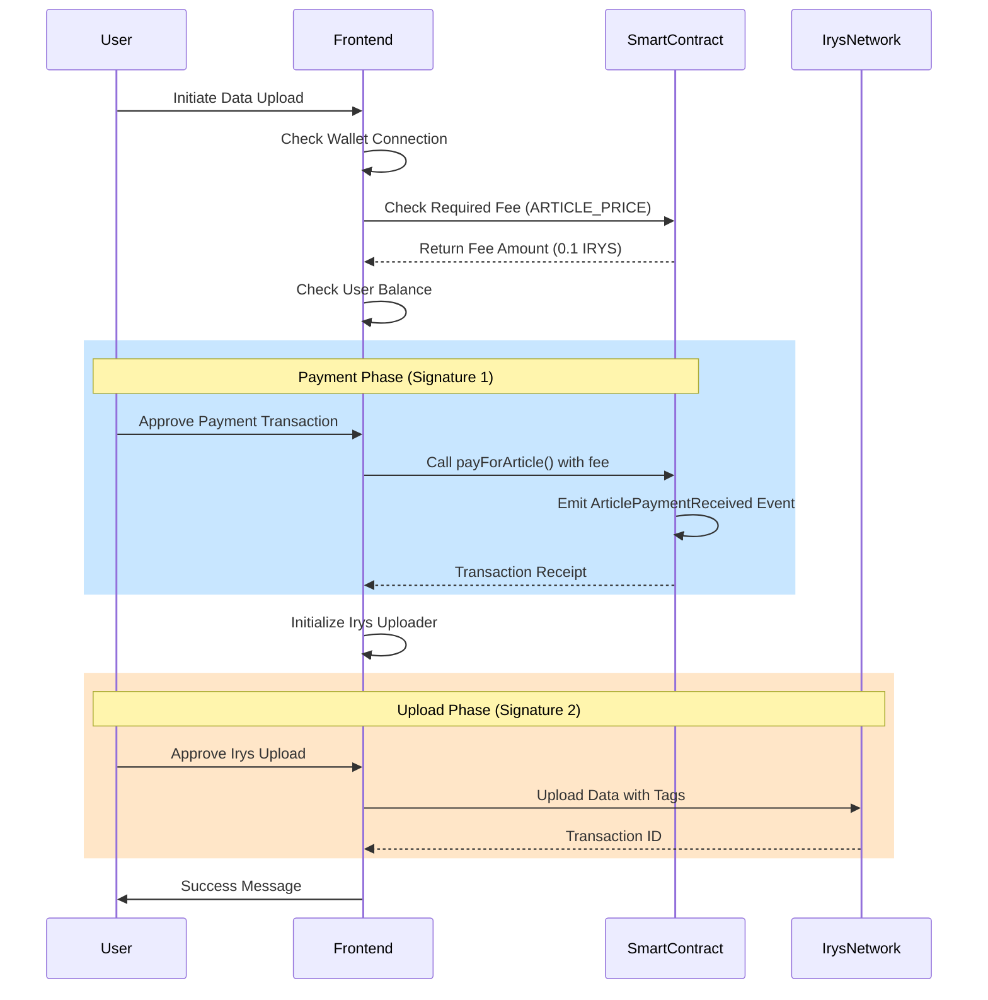

# Implementing Smart Contract Payment for Irys Data Uploads

This guide demonstrates how to implement a payment gateway using smart contracts before uploading data to the Irys network. This ensures users pay a specified fee before they can upload data.

## Overview

The implementation requires two signatures from the user:
1. **Payment Transaction**: User pays the required fee to the smart contract
2. **Irys Upload**: User signs the data upload to Irys network

## Architecture



## Prerequisites

- Deployed payment smart contract on Irys testnet
- React/TypeScript frontend
- ethers.js v6
- @irys/web-upload packages

## Step 1: Smart Contract

Deploy a payment contract to Irys testnet (chain ID: 1270):

```solidity
// SPDX-License-Identifier: MIT
pragma solidity ^0.8.0;

contract IrysPayment {
    uint256 public constant ARTICLE_PRICE = 0.1 ether;
    uint256 public totalArticles;
    
    mapping(address => uint256) public userArticleCount;
    
    event ArticlePaymentReceived(
        address indexed payer,
        uint256 amount,
        uint256 articleId,
        uint256 timestamp
    );
    
    function payForArticle() external payable {
        require(msg.value == ARTICLE_PRICE, "Incorrect payment amount");
        
        totalArticles++;
        userArticleCount[msg.sender]++;
        
        emit ArticlePaymentReceived(
            msg.sender,
            msg.value,
            totalArticles,
            block.timestamp
        );
    }
    
    // Owner can withdraw collected fees
    function withdraw() external onlyOwner {
        payable(owner).transfer(address(this).balance);
    }
}
```

## Step 2: Install Dependencies

```bash
npm install ethers@^6.0.0 @irys/web-upload @irys/web-upload-ethereum @irys/web-upload-ethereum-ethers-v6
```

## Step 3: Configure Contract Interface

```typescript
// config/contracts.ts
export const PAYMENT_CONTRACT_ADDRESS = '0xcEFd26e34d86d07F04D21eDA589b4C81D4f4FcA4';
export const IRYS_TESTNET_RPC = 'https://testnet-rpc.irys.xyz/v1/execution-rpc';

export const PAYMENT_CONTRACT_ABI = [
  'function payForArticle() payable',
  'function ARTICLE_PRICE() view returns (uint256)',
  'event ArticlePaymentReceived(address indexed payer, uint256 amount, uint256 articleId, uint256 timestamp)',
  'function totalArticles() view returns (uint256)',
  'function userArticleCount(address user) view returns (uint256)'
];
```

## Step 4: Implement Irys Uploader Service

```typescript
// services/irysUploadService.ts
import { WebUploader } from '@irys/web-upload';
import { WebEthereum } from '@irys/web-upload-ethereum';
import { EthersV6Adapter } from '@irys/web-upload-ethereum-ethers-v6';
import { ethers } from 'ethers';

let irysUploader: any = null;

export async function initializeIrysUploader(): Promise<any> {
  // Check for wallet providers
  const provider = window.ethereum || (window as any).okxwallet || 
                  ((window as any).web3 && (window as any).web3.currentProvider);
  
  if (!provider) {
    throw new Error('No Web3 provider found');
  }

  try {
    const ethersProvider = new ethers.BrowserProvider(provider);
    const signer = await ethersProvider.getSigner();
    
    // Create Irys uploader
    const webEthereum = WebEthereum;
    const adapter = EthersV6Adapter(ethersProvider);
    const uploader = await WebUploader(webEthereum).withAdapter(adapter);
    
    // Initialize uploader
    await uploader.ready();
    
    irysUploader = uploader;
    return uploader;
  } catch (error) {
    console.error('Failed to initialize Irys uploader:', error);
    throw error;
  }
}

export async function uploadToIrys(
  data: any,
  tags: Array<{ name: string; value: string }>
): Promise<{ success: boolean; transactionId?: string; error?: string }> {
  try {
    if (!irysUploader) {
      await initializeIrysUploader();
    }

    // Convert data to Buffer
    const dataBuffer = Buffer.from(JSON.stringify(data), 'utf-8');
    
    // Upload to Irys
    const response = await irysUploader.upload(dataBuffer, { tags });
    
    return {
      success: true,
      transactionId: response.data.id
    };
  } catch (error) {
    console.error('Upload failed:', error);
    return {
      success: false,
      error: error.message
    };
  }
}
```

## Step 5: Implement Payment and Upload Flow

```typescript
// components/UploadWithPayment.tsx
import React, { useState } from 'react';
import { ethers } from 'ethers';
import { 
  PAYMENT_CONTRACT_ADDRESS, 
  PAYMENT_CONTRACT_ABI,
  IRYS_TESTNET_RPC 
} from '../config/contracts';
import { initializeIrysUploader, uploadToIrys } from '../services/irysUploadService';

export const UploadWithPayment: React.FC = () => {
  const [status, setStatus] = useState('');
  const [txHash, setTxHash] = useState('');
  const [isUploading, setIsUploading] = useState(false);

  const handleUpload = async (data: any) => {
    setIsUploading(true);
    
    try {
      // Step 1: Get wallet provider
      const provider = window.ethereum || (window as any).okxwallet;
      if (!provider) {
        throw new Error('No wallet found');
      }

      // Step 2: Connect to Irys testnet
      try {
        await provider.request({
          method: 'wallet_switchEthereumChain',
          params: [{ chainId: '0x4f6' }], // 1270 in hex
        });
      } catch (switchError: any) {
        if (switchError.code === 4902) {
          // Chain not added, add it
          await provider.request({
            method: 'wallet_addEthereumChain',
            params: [{
              chainId: '0x4f6',
              chainName: 'Irys Testnet',
              nativeCurrency: {
                name: 'IRYS',
                symbol: 'IRYS',
                decimals: 18
              },
              rpcUrls: [IRYS_TESTNET_RPC],
              blockExplorerUrls: ['https://testnet-explorer.irys.xyz']
            }],
          });
        }
      }

      // Step 3: Setup ethers provider
      const ethersProvider = new ethers.BrowserProvider(provider);
      const signer = await ethersProvider.getSigner();
      const signerAddress = await signer.getAddress();

      // Step 4: Check network
      const network = await ethersProvider.getNetwork();
      if (network.chainId !== 1270n) {
        throw new Error('Please switch to Irys testnet');
      }

      // Step 5: Check balance and fee
      const balance = await ethersProvider.getBalance(signerAddress);
      const contract = new ethers.Contract(
        PAYMENT_CONTRACT_ADDRESS, 
        PAYMENT_CONTRACT_ABI, 
        ethersProvider
      );
      const requiredFee = await contract.ARTICLE_PRICE();

      if (balance < requiredFee) {
        throw new Error(`Insufficient balance. Need ${ethers.formatEther(requiredFee)} IRYS`);
      }

      // Step 6: Pay the fee (First signature)
      setStatus('Please confirm the payment transaction (1/2)...');
      const contractWithSigner = new ethers.Contract(
        PAYMENT_CONTRACT_ADDRESS,
        PAYMENT_CONTRACT_ABI,
        signer
      );
      
      const tx = await contractWithSigner.payForArticle({
        value: requiredFee
      });

      setTxHash(tx.hash);
      setStatus('Payment submitted. Waiting for confirmation...');

      // Initialize Irys uploader while waiting
      const uploaderPromise = initializeIrysUploader();

      // Wait for payment confirmation
      const receipt = await tx.wait();

      // Verify payment event
      const paymentEvent = receipt.logs.find((log: any) => {
        try {
          const parsed = contractWithSigner.interface.parseLog(log);
          return parsed?.name === 'ArticlePaymentReceived';
        } catch {
          return false;
        }
      });

      if (!paymentEvent) {
        throw new Error('Payment failed');
      }

      setStatus('Payment confirmed! Preparing upload (2/2)...');

      // Step 7: Upload to Irys (Second signature)
      await uploaderPromise; // Ensure uploader is ready

      const tags = [
        { name: 'App-Name', value: 'YourApp' },
        { name: 'Content-Type', value: 'application/json' },
        { name: 'Type', value: 'article' },
        { name: 'Author', value: signerAddress },
        { name: 'Payment-Tx', value: tx.hash },
        { name: 'Created-At', value: Date.now().toString() }
      ];

      setStatus('Please confirm the Irys upload signature (2/2)...');
      const uploadResult = await uploadToIrys(data, tags);

      if (!uploadResult.success) {
        throw new Error(uploadResult.error || 'Upload failed');
      }

      setStatus(`Success! Irys TX: ${uploadResult.transactionId}`);
      
      // Return both transaction IDs
      return {
        paymentTx: tx.hash,
        irysId: uploadResult.transactionId
      };

    } catch (error: any) {
      console.error('Upload failed:', error);
      setStatus(`Error: ${error.message}`);
      throw error;
    } finally {
      setIsUploading(false);
    }
  };

  return (
    <div>
      <button 
        onClick={() => handleUpload({ content: 'Your data here' })}
        disabled={isUploading}
      >
        Upload with Payment (0.1 IRYS)
      </button>
      
      {status && <p>Status: {status}</p>}
      {txHash && (
        <p>
          Payment TX: 
          <a 
            href={`https://testnet-explorer.irys.xyz/tx/${txHash}`}
            target="_blank"
            rel="noopener noreferrer"
          >
            {txHash.slice(0, 8)}...{txHash.slice(-6)}
          </a>
        </p>
      )}
    </div>
  );
};
```

## Step 6: Handle Edge Cases

```typescript
// Add to your upload handler
const handleUploadWithRetry = async (data: any, maxRetries = 3) => {
  for (let attempt = 1; attempt <= maxRetries; attempt++) {
    try {
      return await handleUpload(data);
    } catch (error: any) {
      if (error.message.includes('User rejected')) {
        // User cancelled, don't retry
        throw error;
      }
      
      if (attempt === maxRetries) {
        throw error;
      }
      
      // Wait before retry
      await new Promise(resolve => setTimeout(resolve, 1000 * attempt));
    }
  }
};
```

## Best Practices

1. **User Experience**
   - Show clear status messages for each step
   - Indicate which signature (1/2 or 2/2) is required
   - Display transaction hashes with explorer links

2. **Error Handling**
   - Handle wallet connection errors
   - Check network and balance before payment
   - Verify payment success before upload

3. **Performance**
   - Initialize Irys uploader while payment is processing
   - Cache uploader instance for subsequent uploads

4. **Security**
   - Never store private keys
   - Validate all user inputs
   - Use environment variables for contract addresses

## Testing

1. Deploy contract to Irys testnet
2. Fund test wallet with IRYS tokens
3. Test payment flow
4. Verify uploaded data on Irys gateway

## Common Issues

### "MetaMask is not installed" with OKX Wallet
```typescript
// Support multiple wallet providers
const provider = window.ethereum || 
                (window as any).okxwallet || 
                (window as any).web3?.currentProvider;
```

### Long delay between signatures
```typescript
// Pre-initialize Irys uploader during payment
const uploaderPromise = initializeIrysUploader();
const receipt = await tx.wait();
await uploaderPromise; // Ready when needed
```

### Network switching issues
```typescript
// Add network if not present
catch (switchError: any) {
  if (switchError.code === 4902) {
    await provider.request({
      method: 'wallet_addEthereumChain',
      params: [/* network config */]
    });
  }
}
```

## Resources

- [Irys Documentation](https://docs.irys.xyz)
- [Ethers.js v6 Documentation](https://docs.ethers.org/v6/)
- [Irys Testnet Explorer](https://testnet-explorer.irys.xyz)

## License

MIT 